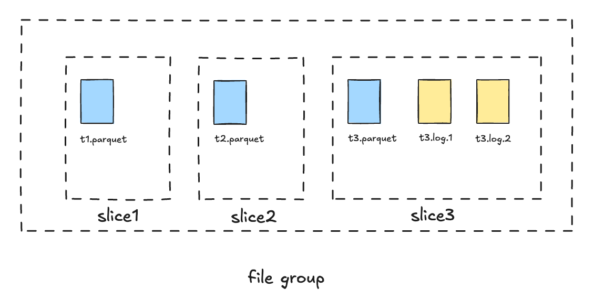

## Apache Hudi 1.1 前瞻：Flink Writer 的异步 Instant 生成

### 背景

Hudi 1.1 release 之前为了保证 Hudi Flink Sink 的 Exactly-Once 写入语义，新的 Instant 需要等待上一个 Instant 提交到 Hudi 之后才能生成，这段时间需要 Writer 阻塞等待。从 Hudi 1.1 开始，Flink Writer 引入了一种新的异步 Instant 生成机制，这种方式允许 Writer 在前一个 Instant 尚未完成提交时，就能请求下一个新 Instant。同时它仍然保证了多事务提交的顺序与一致性。在接下来的章节中，我们先简单介绍一些 Hudi 的基础概念，然后深入探讨异步 instant 生成的流程细节。

### Instant Time

Timeline 是 Hudi 架构中的核心组件，它作为表状态的唯一可信来源，记录了对表执行的所有操作，每个操作由一个 Commit 来标识，并带有单调递增的 Instant Time，表示每个操作的事务开始时间。

Hudi 基于 Instant Time 提供以下功能：

* 更高效的失败写入回滚：每个 Hudi Commit 都对应一个 Instant Time, Instant 时间戳可用于快速定位失败写入的文件。

* 基于文件名的 File Slicing：Instant time 被编码进文件名之中，通过文件名即可对一个表中不同版本的文件进行高效的 File Slicing.

* 增量查询：每个 Row 会带有一个 `_hoodie_commit_time` 元数据字段，即使在异步运行 Full Compaction / Clean 等表服务情况下，也支持任意时间的增量查询。

### Completion Time

#### 基于 Instant Time 的 File Slicing

在 1.0.0 之前的旧版本中，Hudi 以 FileGroup 为单位组织数据文件。 每个 FileGroup 包含多个 FileSlice，每个 FileSlice 中包含一个 Base 文件和多个 Log 文件。每次对该 FileGroup 进行压缩 (Compaction) 时，都会生成一个新的 FileSlice。 Base 文件名中的时间戳对应写入该文件的 Compaction 操作的 Instant Time。Log 文件名中的时间戳与当前 File Slice 的 Base Instant Time 相同，具有相同 Instant Time 的数据文件属于同一个 FileSlice。

在并发写入场景中， Log 文件的 Instant Time 命名规范带来一些限制：随着异步 Compaction 的推进，Base Instant Time 会变化。为了让 Writer 能确定 Base Instant Time，需要保证写入提交和 Compaction 调度之间的顺序，即只有当表中没有正在进行的写入操作时，才能调度 Compaction。否则 Log 文件可能会使用错误的 Base Instant Time ，从而导致数据丢失。因此在并发模式下，Compaction 调度可能会阻塞所有 Writer。

#### 基于 Completion Time 的 File Slicing

为了解决这些问题，自 1.0.0 版本起，Hudi 引入了一种基于 Requested Time 和 Completion Time 时间区间的 File Slicing。在 1.x 版本中，每个 commit 有两个重要的时间概念：Requested time 和 Completion time。所有生成的时间戳在全局范围内都是单调递增的。Log 文件名中的时间戳不再是 Base Instant Time，而是使用写入操作的 Requested Instant Time。在 File Slicing 过程中，Hudi 会根据 Instant Time 查询每个日志文件的 Completion time，并制定了新的文件切片规则：

> 一个 Log 文件属于 Base Requested Time 最大, 且 Base Requested Time 小于等于该 Log 文件 Completion Time 的 FileSlice \[5]。

新的 File Slicing 机制更加灵活，Compaction 调度与 Writer 写入流程可完全解耦。基于此机制，Hudi 也实现了更加强大的 Non-blocking Concurrency Control，详细内容见 RFC-66 \[5].

#### LSM Timeline

新 File Slicing 机制要求能够高效地根据 Instant Time 查询对应的 Completion Time。 从 1.x 版本开始，Hudi 重新实现了Archived Timeline，新 Archived Timeline 的数据文件采用 LSM 树的方式组织，以支持基于 Instant Time 时间范围的快速过滤查询，并在此基础上实现了高效 Data-Skipping。更多详细内容参考 \[6].

### True Time

Hudi 的 Timeline 有一个关键前提：Instant 时间戳必须在全局范围内单调递增且无冲突。然而，在分布式事务中保持时间的单调性一直是一个棘手问题，主要原因包括：

* 时钟偏差（Clock skew）：不同机器上的物理时钟会发生漂移；

* 网络延迟（Network latency）：跨数据中心的通信延时；

* 并发事务（Concurrent transactions）：跨地域确定事件顺序的困难。

为了解决这一问题，Google Spanner 的 TrueTime\[1] 采用了具有确定性误差范围的全局同步时钟，从而能够无冲突地分配单调递增的时间戳。类似地，Hudi 从 1.0 版本开始引入了 TrueTime API \[2]。

通常有两种方式实现 TrueTime 语义：

* 单一的共享时间生成进程或服务：类似于 Google Spanner 的 Time service；

* 各进程独立生成时间，并在分布式锁的协调下，等待其时间大于等于所有进程中的最大预期时钟漂移值。

Hudi 的 TrueTime API 采用了第二种方式：通过分布式锁保证同一时刻只有一个进程在生成时间，同时通过等待机制确保经过足够的时间间隔，保证生成的 Instant Time 在全局范围内是单调递增的。

### Flink Writer 阻塞式 Instant 生成

对于 Flink 流式摄取，每个事务的写入大致分为以下几个阶段：

1. Writer 将数据写入内存缓冲区。

2. 当缓冲区写满或 Checkpoint 触发时，Writer 向 Coordinator 请求写入所需的 Instant Time。

3. Writer 根据 Instant Time 创建数据文件，将数据刷入到存储。

4. Coordinator 在收到 Checkpoint 的成功确认事件后，提交已刷盘的文件及相关元数据。

从 Hudi 的 File Slicing 机制可以看出，在 Writer 将数据写入到存储前，Instant Time 是必需的。Hudi 1.1 之前，虽然提交操作在 Coordinator 中是异步进行的，但 Writer 对新的 Instant 的请求将会被阻塞，因为只有在前一个 Instant 成功提交后，Coordinator 才能创建一个新的 Instant。举例来说：假设一批数据在 Writer 中随 Checkpoint `ckp_1` 于时间 T1 完成刷盘，而 `ckp_1` 于时间 T2 完成提交，那么 Writer 将在时间区间 \[T1, T2] 内被阻塞（新 Instant 时间戳只有在 `ckp_1` 完成事件被处理并提交到 Hudi Timeline 后才生成）。这种阻塞行为虽然确保了多个 Instant 之间的严格顺序性，但在大规模负载下可能导致显著的吞吐波动。

### Flink Writer 异步 Instant 生成

为了解决由阻塞式 Instant 生成导致的吞吐波动问题，Hudi 1.1 为 Flink Writer 引入了异步 Instant 生成机制。沿用前述例子，“异步”意味着在前一个 Instant 尚未成功提交到 Timeline之前（时间区间 \[T1, T2]），Coordinator 就可以创建一个新的 Instant 并返回给 Writer 用来刷盘新一批数据，从而 Writer 在 Checkpoint 期间不再被阻塞，流式摄取的吞吐会更加稳定和平滑。

**总体写入流程：**

* **Writer**：执行数据刷盘前向 Coordinator 请求 Instant Time：

  * 数据刷盘可能是由 Checkpoint 触发或缓存写满触发，所以请求中携带的是上一次成功执行的 Checkpoint ID，而非当前 Checkpoint ID；

  * 对于任务初次启动的请求，若是有状态重启，则 Checkpoint ID 是从状态中恢复，否则为 -1；

* **Coordinator**：负责 Instant 生成，每个 Checkpoint ID 对应一个 Instant，Coordinator 上在内存中维护着二者的一一映射关系 (WriteMeta Buffer): `CheckpointID → {Instant → {Writer TaskID → Writer MetaEvent}}` ，其中 `{Writer TaskID → Writer MetaEvent}` 是每个 Writer 并发任务 ID 与其在当前 Checkpoint 间隔内写入的文件元信息的映射；收到 Writer 的 Instant 请求后：

  * 若 WriteMeta Buffer 中已存在 Checkpoint ID 对应的 Instant, 则直接返回缓存的 Instant;

  * 否则生成一个新的 Instant 更新到 WriteMeta Buffer 中，然后返回给 Writer;

* **Writer**：完成数据写入，生成数据文件并发送文件元信息到 Coordinator；

* **Coordinator**：收到 Writer 发送的数据文件元信息，更新到内存中维护的 WriteMeta Buffer 中：

  * 若 WriteMeta Buffer 中无当前 Writer task 的文件元信息，则直接写入缓存中；

  * 若 WriteMeta Buffer 中存在当前 Writer task 的文件元信息（Writer 存在多次 Flush），则将文件元信息进行合并，然后更新缓存；

* **Coordinator**：收到 Checkpoint (ID = n) 完成的 ACK 事件，开始串行并有序的提交 WriteMeta Buffer 中记录的 Instants，提交范围包括所有 Checkpoint ID < n 所对应的 Instants，提交成功后将 Instant 从缓存中删除。

  * Flink 的 Checkpoint ACK 机制不能保证 Coordinator 会收到每个 Checkpoint 的 ACK 事件，提交逻辑需要遵循 Flink 的 Checkpoint Subsume Contract\[4]：即如果一个 Checkpoint `ckp_i` 的 ACK 未收到，其写入的元数据会被纳入下一个 Checkpoint `ckp_i+1` 的待提交元数据中，并在收到 `ckp_i+1` 的 ACK 事件后统一进行提交。

#### WriteMeta Failover 机制

考虑 Coordinator 不能确保收到 Checkpoint ACK 事件，所以内存缓存中的 WriteMeta 需要持久化到 Flink State 中，以防止在 Task Failover 后出现 WriteMeta 丢失，从而导致数据缺失。在设计WriteMeta 的 Snapshot 时，需要考虑以下两点：

* WriteMeta 首先是存储在 Writer 算子缓存，在 Checkpoint 触发或 Eager flush 时 Writer 才将当前 WriteMeta 发送到 Coordinator;

* Checkpoint 触发时，Coordinator 会首先进行 Snapshot, 而后再进行 Writer 算子的 Snapshot，所以此时 Coordinator 缓存中还没有当前 Checkpoint 间隔内的 WriteMeta；

基于以上两点考虑，Checkpoint i 触发时 WriteMeta 的 Snapshot 流程如图所示：

1. Coordinator 首先将 `ckp_id`  < i 的 WriteMeta 持久化到 State 中；

2. Writer 将 `ckp_i` 期间的 WriteMeta 发送到 Coordinator，等待提交；

3. Writer 将清理 State 中历史 WriteMeta, 并将 `ckp_i` 期间的 WriteMeta 持久化到 State 中；

通过这种 WriteMeta 缓存的持久化方式，既保证了数据元信息不会丢失，也避免了WriteMeta State 的膨胀问题。

### 总结

Hudi 1.1 引入的异步 Instant 生成机制，是 Flink 流式摄取稳定性提升的一个重要特性。通过消除对前一个 Instant 完成提交的阻塞依赖，解决了大规模负载下的吞吐波动和反压问题。同时它仍然保持了强事务保证，并与 Flink 的 Checkpoint 语义实现无缝集成。这一增强完全向后兼容并对最终用户透明，使现有 Flink 流式摄取任务能够在最小改动下立即受益，实现更平滑、更可扩展的入湖。随着实时数据湖需求的持续增长，此创新对于构建高性能、可靠的湖仓架构提供了更加扎实的保障。

### 引用

\[1] <https://research.google/pubs/spanner-truetime-and-the-cap-theorem/>

\[2] <https://hudi.apache.org/docs/next/timeline/#timeline-components>

\[3] <https://github.com/apache/hudi/blob/master/rfc/rfc-66/rfc-66.md>

\[4] <https://github.com/apache/flink/blob/master/flink-core/src/main/java/org/apache/flink/api/common/state/CheckpointListener.java>

\[5] <https://github.com/apache/hudi/blob/master/rfc/rfc-66/rfc-66.md>

\[6] <https://hudi.apache.org/docs/next/timeline/#lsm-timeline-history>
