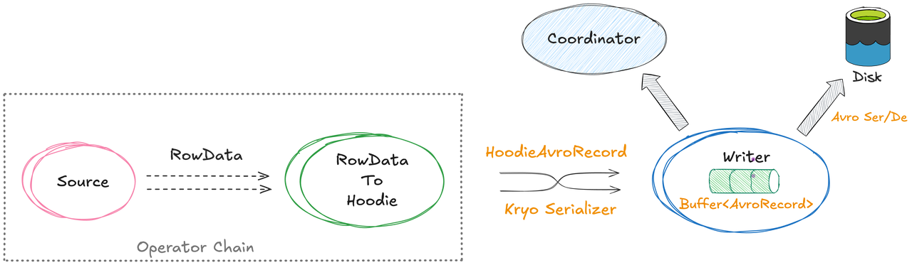
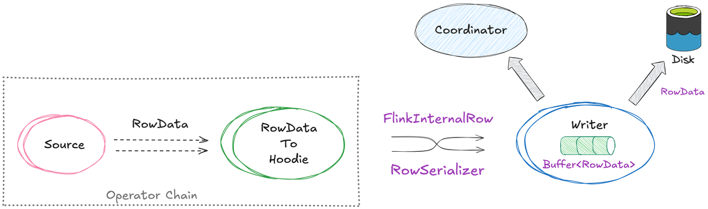
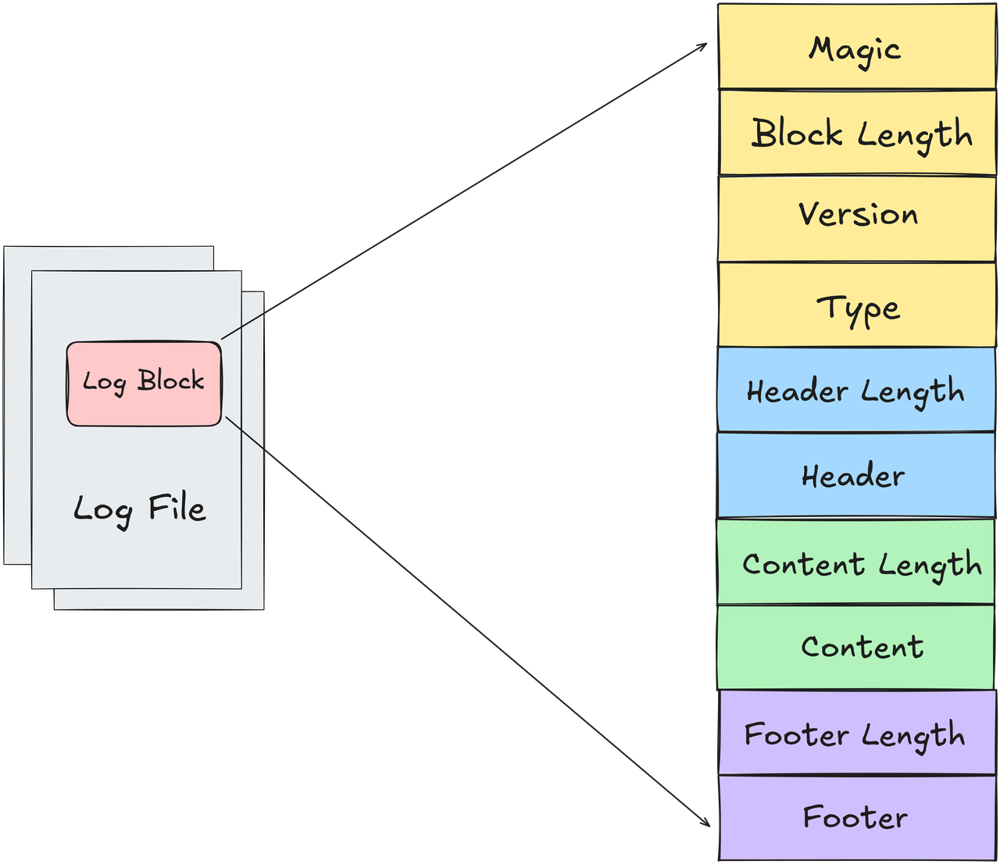
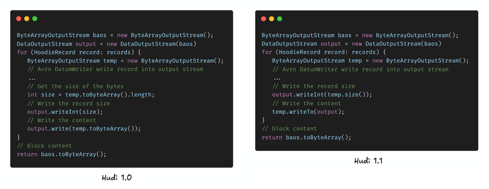
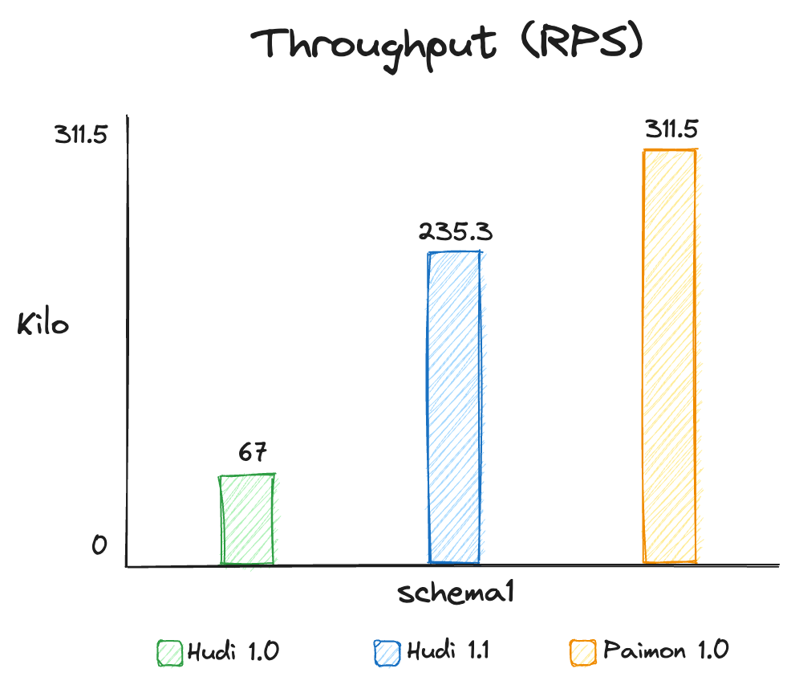
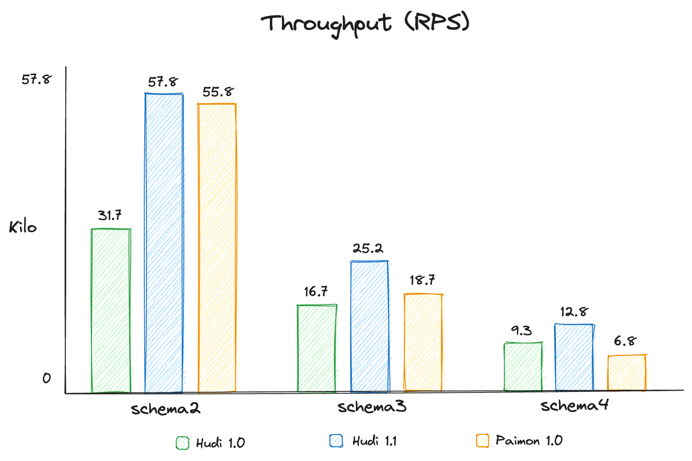

## Apache Hudi 1.1 前瞻：Flink 流式入湖的极致优化

### 背景

随着实时数据处理的兴起，流式入湖已成为 Apache Hudi 的核心应用场景。Apache Flink 作为强大的流处理框架，已与 Hudi 实现无缝集成，支持将准实时数据高效写入 Hudi。虽然现有集成已提供强大而完备的能力，包括基于 Flink 检查点机制实现的 Exactly-Once 语义、灵活的写入模式以及丰富的索引功能，但当数据规模达到 PB 级别时，流式入湖的性能优化仍面临重大挑战，例如流处理作业的反压问题和高资源成本问题。影响流式入湖性能的因素涉及多个层面，比如 Flink 算子间的网络 shuffle 开销、Hudi Writer 内部的 Ser/De 成本，以及内存缓冲管理引发的 GC 问题。在 Hudi 1.1 版本中，我们通过精细的重构与优化解决了这些痛点，显著提升了 Flink 流式入湖的性能与稳定性。后续章节将重点介绍以下关键性能优化：

* Flink 算子间的 Ser/De 开销优化

* 高性能 Flink 原生 Writer

* 日志文件写入的字节拷贝优化

文章最后，我们将通过流式入湖的性能基准测试，具体展示 Hudi 1.1 版本在 Flink 流式入湖场景取得的优化效果。

### Flink 算子间的 Ser/De 开销优化

在 Hudi 1.1 版本之前，Avro 格式是 Flink 读写路径中的默认数据格式。这意味着写入 Pipeline 的首要步骤，就是将 Flink 的 `RowData` 转换为 Avro Record，随后才能构建 Hudi 内部的 `HoodieRecord` 对象进行后续写入处理。

当 Flink 任务存在多个算子且算子未被 Chain 一起时 (即未运行于同一 JVM 进程中)，数据则需先序列化为字节流才能通过网络 Shuffle 传输至下游算子。如果序列化执行得不够高效，仅 Shuffle 序列化这一环节就可能消耗大量资源。因此当你查看作业的 profiler 输出时，通常会发现序列化占据了 CPU 开销的前几位。

Flink 本身提供了开箱即用的序列化框架，对基础类型（如原生数据类型和 Row 类型）内置了高效序列化器。但对于通用类型（例如 `HoodieRecord`），Flink 会回退使用基于 Kryo 的默认序列化器，其性能表现不尽如人意。

RFC-84 \[1] 提出了针对 Hudi 写入 Pipeline 中算子间 Ser/De 开销的改进方案，基于 Flink 可扩展的类型系统，实现了以下优化：

* `HoodieFlinkInternalRow`：一种用于替代 `HoodieRecord` 的对象，在数据 Shuffle 过程中使用。它包含一个 RowData 作为数据字段，以及一些必要的元数据字段，例如 record key、partition path 等；

* `HoodieFlinkInternalRowTypeInfo`：针对 `HoodieFlinkInternalRow` 定制的 Flink 类型信息；

* `HoodieFlinkInternalRowSerializer`：专为 `HoodieFlinkInternalRow` 设计的高效 Flink 类型序列化器；

通过定制的 Flink 原生数据结构和配套的序列化器，Flink Hudi 流式写入的平均吞吐量可以提升约 25%。

### 高性能 Flink 原生 Writer

在之前版本中，Hudi Flink Writer 使用 `HoodieRecord<AvroPayload>` （数据通过 Avro 序列化）来表示输入数据。虽然这种统一格式可以跨引擎通用，但它带来了额外的性能开销：

* 冗余的 Ser/De 开销 以写入 MOR 表为例，Flink 输入的数据格式是 `RowData`，首先会被转换为 Avro 的 `GenericRecord`，然后再序列化为 Avro 字节存入内部的 `HoodieAvroRecord`。在后续日志写入过程中，这些 `HoodieAvroRecord` 中的字节数据又被反序列化为 Avro 的 `IndexedRecord` 以便进行数据重写加工，然后才能追加到日志文件。显然以 Avro 作为中间数据表示，会引入显著的 Ser/De 序列化开销。

* 较大内存的消耗 Writer 内部的缓冲区是一个包含中间 Avro 对象的 Java List，这些对象会在数据刷盘后释放。在高吞吐的流式工作负载下，这些对象会显著增加堆内存的占用，加剧 GC 压力。

#### RFC-87: Flink 原生写入器

RFC-87 提出了一种数据表格式的变更：Flink 写入器不再将 `RowData` 转换为 Avro 格式，而是直接将 `RowData` 封装在一个专门的 `HoodieRecord` 中，整体写入路径几乎全部围绕 `RowData` 数据结构进行处理，消除了所有冗余的转换开销，并且此改动对整个 Hudi Flink 写入的生命周期是透明的。

**关键变更：**

* 定制化 `HoodieRecord`：引入了 `HoodieFlinkRecord` 来直接封装 Flink 的 `RowData` ，写入路径中不再进行额外的 Avro 转换。

* 自管理的二进制缓冲区：Flink内部的 `BinaryRowData` 本身采用二进制格式。我们实现了二进制缓冲区来缓存 `RowData`  字节流，该内存由写入器自主管理，在缓存的 `RowData` 字节刷盘后可重复利用。这种托管式二进制缓冲区能有效缓解高吞吐量场景下的 GC 压力。

* 灵活的日志格式：对于 MOR 表，数据以数据块 (Block) 形式写入日志文件。目前支持两种 Block 类型：

  * Avro 数据 Block：针对行级写入进行了优化，非常适合流式入湖或频繁更新的场景，也是日志文件的默认 Block 类型。

  * Parquet 数据 Block：列式存储，更适合高压缩比的数据，例如字段为原始类型的数据。

通过利用 Flink 原生的数据模型，流式入湖链路中冗余的 Avro 转换及 Ser/De 开销被消除，从而在写入延迟和资源消耗上都带来了显著提升。

### MOR 日志文件写入的字节拷贝优化

Mor 表的日志文件由数据块 (Log Block) 组成，在写入日志文件时是以数据 Block 作为基本单位进行写入，每个 Block 包含的主要内容如下图所示，其中数据内容 (Content) 是将 Writer 内存缓冲区中的数据序列化成指定格式的二进制数据。

上一节中提到，日志文件默认使用的是 AVRO Block, Hudi 1.1 版本针对该类型 Block 的序列化也进行了细致优化，即消除了 Record 级别的字节拷贝开销（这个优化也包括在 1.0.2）。Hudi 1.1 版本前每条数据通过 AVRO Writer 写入到 `ByteArrayOutputStream` 中，而后通过 `toByteArray` 方法获取 byte 数组写入到外层 Block 输出流中，而 `toByteArray` 方法底层会新创建 byte 数组，并将数据拷贝到新 byte 数组返回，且该字节拷贝是在 Record 级别进行的，在大流量场景会产生大量的临时对象，加剧 GC 压力。

**优化改进：**

Hudi 1.1 版本中利用 `ByteArrayOutputStream` 自身提供的 `writeTo` 方法，直接将底层 byte 数组写入到外层 Block 输出流中，从而避免了额外的 Record 级别字节拷贝，有效的缓解了 GC 压力。

### 性能基准测试

为了展示 Flink 在流式入湖场景的性能提升，我们对 Hudi 1.1、Hudi 1.0 和 Apache Paimon 1.0.1 进行了全面的基准测试。由于目前缺乏流式读写领域的标准测试数据集，为确保测试过程的透明性与结果的可复现性，我们决定采用基于 Nexmark\[4] 的 Apache Paimon 集群基准测试\[3]，此前 Paimon 声称在该基准测试中入湖性能相对 Hudi 有数倍提升，是向用户推广的核心卖点之一。

#### 集群配置

基准测试运行在阿里云EMR集群环境中，具体配置如下：

* EMR on ECS: version 5.18.1

  * Master (x1): 8 vCPU, 32 GiB, 5 Gbps

  * Worker (x4): 24 vCPU, 96 GiB, 12 Gbps

* Apache Hudi version: 1.1 and 1.0.1

* Apache Paimon version: 1.0.1

* Apache Flink version: 1.17.2

* Hdfs version: 3.2.1

#### 流式入湖场景

测试场景采用生产环境中最常见的流式入湖场景：MOR 表，使用 UPSERT 操作及 Bucket 索引。我们使用 Paimon Benchmark 程序模拟工作负载，数据源由 Flink 的 Datagen Connector 生成，主键范围为 0 到 100,000,000，总数据量为 5 亿条。更多详细设置请参考[这里](https://github.com/cshuo/streaming-benchmark)。

需要注意的是，我们在测试入湖任务中禁用了 Compaction，因为 Compaction 会显著影响 Hudi 和 Paimon 的写入性能，从而干扰对入湖性能的公平比较。实际上，这在生产环境中也是常见做法。

此外，表的 schema 对写入性能也有重要影响。数值型基本字段和字符串类型字段在处理开销上存在明显差异。因此，除了 Paimon Benchmark 程序中使用的默认表 schema（Schema1）外，我们还增加了 3 种主要包含字符串类型字段的不同 schema，这种表在生产场景中更加常见。

| Schema1                     | Schema2          | Schema3          | Schema4           |
| --------------------------- | ---------------- | ---------------- | ----------------- |
| 1 String + 10 BIGINT fields | 20 String fields | 50 String fields | 100 String fields |

#### 基准测试结果

* 对于几乎全部字段为数值类型的 Schema1，Hudi 1.1 的流式入湖性能约为 Hudi 1.0 的 3.5 倍。性能提升主要来源于 RFC-84 和 RFC-87 引入的优化，这些优化减少了写入 Pipeline 中 shuffle 的 Ser/De 开销，以及 Writer 内部的 Avro Ser/De 成本。

* Paimon 的流式入湖吞吐略高于 Hudi 1.1。通过详细的性能分析，我们发现这一性能差距主要源于每条 HoodieRecord 默认包含 5 个额外的字符串类型的元数据字段，而在像 Schema1 这样简单的 Schema 场景下，这些 Record 级别的额外字段对性能产生了显著影响。

* 对于大部分字段为字符类型的 Schema，Hudi 1.1 的流式入湖性能最佳。根据性能分析，我们发现当数据字段全部为字符串时，Paimon 直接写入 Parquet 文件时的压缩开销会对吞吐产生负面影响——即使基准测试使用的是最快的 SNAPPY 压缩算法。相比之下，Hudi 将增量数据以行式 AVRO 格式写入日志文件，虽然压缩比更低，但这种方式在各种工作负载下对入湖吞吐更加友好。

### 总结

Hudi 1.1 在 Flink 写入器性能方面的优化，为流式入湖的吞吐带来了显著的数倍提升。此外这些增强是透明的且向后兼容，使用户能够无缝将作业从早期 Hudi 版本升级到最新版本，无需额外运维开销即可享受到极致的性能提升。

### 引用

\[1] <https://github.com/apache/hudi/blob/master/rfc/rfc-84/rfc-84.md>

\[2] <https://github.com/apache/hudi/blob/master/rfc/rfc-87/rfc-87.md>

\[3] <https://github.com/apache/paimon/tree/master/paimon-benchmark/paimon-cluster-benchmark>

\[4] <https://github.com/nexmark/nexmark>
